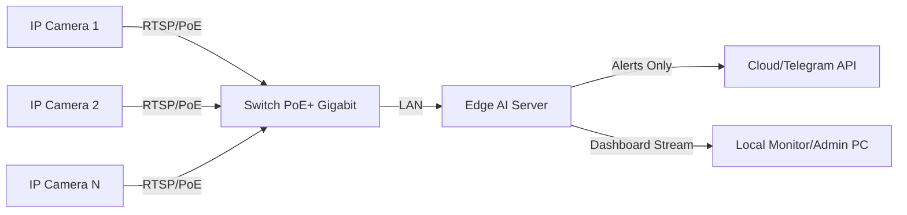

# Spesifikasi Perangkat Keras & Arsitektur Sistem SmartAPD
**Dokumen Teknis Pengadaan & Implementasi Industrial IoT**

---

## 1. Ringkasan Eksekutif & Topologi Sistem

Sistem SmartAPD dirancang menggunakan arsitektur **Edge Computing** terdesentralisasi. Pemrosesan AI (Computer Vision) dilakukan secara lokal di lokasi pabrik (On-Premise) untuk menjamin latensi rendah (<100ms), privasi data, dan operasional tanpa ketergantungan internet yang konstan.

### Arsitektur Topologi

---

## 2. Rekomendasi Perangkat Keras (Hardware Recommendations)

Untuk performa deteksi Real-Time (30 FPS) menggunakan model YOLOv8, kami merekomendasikan dua opsi konfigurasi berdasarkan skala implementasi.

### Opsi A: Embedded Edge (Skala Kecil - Menengah: 1-4 Kamera)
Cocok untuk mobile site, area konstruksi terbatas, atau pos pemantauan mandiri.
*   **Perangkat Utama**: NVIDIA Jetson Orin Nano (8GB) atau Jetson Orin NX (16GB).
*   **Performa AI**: 40 - 100 TOPS (Trillion Operations Per Second).
*   **Konsumsi Daya**: 7W - 25W (Sangat Hemat Energi).

### Opsi B: Industrial PC Server (Skala Besar: 5-16 Kamera)
Cocok untuk pabrik manufaktur permanen atau site plant luas.
*   **Processor (CPU)**: Intel Core i7 Gen 12/13 atau AMD Ryzen 7 (Min. 8 Cores).
*   **Unit Pemrosesan Grafis (GPU)**:
    *   NVIDIA GeForce RTX 3060 12GB (Entry Level).
    *   NVIDIA RTX 4000 Ada Generation (Professional Grade).
    *   *Wajib memiliki VRAM minimal 8GB untuk memuat multiple streams.*
*   **Memory (RAM)**: 32GB DDR4/DDR5 Dual Channel.
*   **Penyimpanan**: 1TB NVMe SSD (Gen 4) untuk sistem & buffering video.

### Spesifikasi Kamera (CCTV)
*   **Tipe**: IP Camera (Network Camera).
*   **Resolusi**: Minimal 1080p (2MP), Disarankan 4MP untuk deteksi detail APD kecil (sarung tangan/kacamata).
*   **Protokol**: Mendukung RTSP (Real Time Streaming Protocol) & ONVIF.
*   **Fitur Wajib**:
    *   **WDR (Wide Dynamic Range)**: 120dB (Penting untuk area dengan kontras cahaya tinggi/pintu masuk pabrik).
    *   **Low Light**: Kemampuan 0.005 Lux (Color) untuk shift malam.
    *   **Kompresi**: H.265+ (Menghemat bandwidth).
    *   **Rating**: IP67 (Tahan Debu & Air) & IK10 (Vandal Proof).

---

## 3. Persyaratan Sistem Minimum (Minimum System Requirements)

Spesifikasi ini adalah batas bawah absolut untuk menjalankan **1 stream kamera** dengan model YOLOv8n (Nano) pada 15 FPS.

| Komponen | Spesifikasi Minimum | Catatan |
| :--- | :--- | :--- |
| **OS** | Ubuntu 20.04 / 22.04 LTS | Linux lebih stabil untuk server 24/7 |
| **CPU** | Quad-Core 2.0 GHz | Intel i3 / ARMv8 |
| **RAM** | 8 GB | Python & Video Buffer memakan RAM signifikan |
| **GPU** | NVIDIA Pascal Arch (4GB VRAM) | CUDA Compute Capability > 6.0 |
| **Storage** | 256 GB SSD | HDD tidak disarankan untuk OS |
| **Network** | Gigabit Ethernet (1000 Mbps) | Koneksi kabel LAN stabil |

---

## 4. Persyaratan Jaringan & Infrastruktur (Network Requirements)

Kestabilan jaringan lokal adalah kunci keberhasilan sistem real-time.

### Bandwidth Lokal (LAN)
Setiap kamera 4MP H.265+ membutuhkan bandwidth rata-rata 4-6 Mbps.
*   Total Bandwidth (16 Kamera): ~96 Mbps constant throughput.
*   **Rekomendasi Switch**: Managed Gigabit Switch dengan PoE+ (802.3at) power budget minimal 250W.

### Konektivitas Internet
Internet **HANYA** dibutuhkan untuk:
1.  Mengirim notifikasi teks/gambar ke Telegram (Payload sangat kecil, ~KB).
2.  Sinkronisasi jam (NTP) dan update software berkala.
*   Sistem **TETAP BERJALAN** normal saat internet mati (Offline Mode), log disimpan lokal.

### Keamanan Jaringan
*   **Isolasi**: Gunakan VLAN khusus untuk CCTV, terpisah dari jaringan Wi-Fi kantor/tamu.
*   **VPN**: Akses remote dashboard wajib menggunakan VPN (WireGuard/OpenVPN), jangan expose port dashboard langsung ke internet publik.

---

## 5. Skalabilitas & Ekspansi (Scalability Strategy)

Bagaimana sistem SmartAPD berkembang dari pilot project menjadi full deployment.

### Strategi Multi-GPU & Clustering
Untuk menangani lebih dari 16 kamera dalam satu fasilitas:
1.  **Vertical Scaling**: Menambah GPU sekunder pada server (misal: 2x RTX 3060). Script SmartAPD mendukung alokasi kamera ke GPU spesifik (CUDA_VISIBLE_DEVICES).
2.  **Horizontal Scaling (Distributed Edge)**: Menempatkan beberapa mini-server (Edge Nodes) di setiap zona pabrik (misal: Zona Gudang, Zona Produksi, Zona Loading).
    *   Setiap Node memproses 4-8 kamera secara lokal.
    *   Semua Node mengirimkan metadata hasil deteksi (bukan video mentah) ke satu Central Dashboard Server untuk rekapitulasi.

### Integrasi NVR (Network Video Recorder)
Sistem SmartAPD dapat bekerja *berdampingan* dengan NVR konvensional.
*   Stream RTSP dicabang: Satu ke NVR untuk rekaman arsip 24 jam, satu ke Server SmartAPD untuk analisis AI.
