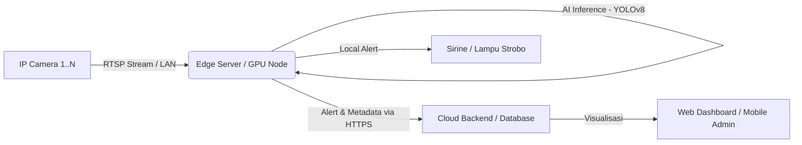

# SPESIFIKASI TEKNIS PERANGKAT KERAS & INFRASTRUKTUR (HARDWARE SPECS)
**Project:** SmartAPD - Industrial Safety Monitoring System  
**Document Version:** 1.0  
**Status:** Draft Proposal  

---

## 1. Topologi Sistem & Arsitektur Edge Computing

SmartAPD mengadopsi arsitektur **Hybrid Edge-Cloud**. Pemrosesan berat (Inferensi AI / Computer Vision) dilakukan secara lokal di pabrik (*On-Premise*) untuk menjamin *low-latency* dan privasi data, sementara Cloud (Dashboard Web) hanya menerima metadata kejadian, statistik, dan bukti pelanggaran (snapshot/short clip).

### Diagram Alur Data

### Komponen Utama

#### A. Edge Processing Unit (Otak Sistem)
Perangkat ini bertugas men-decode stream video dan menjalankan model Deep Learning. Kami merekomendasikan dua opsi berdasarkan skala implementasi:

*   **Opsi 1: Embedded Edge (Skala Kecil/Terdistribusi - 1 s.d. 4 Kamera)**
    *   **Device:** NVIDIA Jetson Orin Nano atau Orin NX.
    *   **Keunggulan:** Konsumsi daya rendah (<15W), *form factor* kecil, *ruggedized* (tahan guncangan/debu).
    *   **Penggunaan:** Dipasang langsung di tiang/panel dekat area kerja spesifik.

*   **Opsi 2: Industrial PC / Server (Skala Menengah/Besar - 8 s.d. 16 Kamera)**
    *   **Device:** Industrial PC (IPC) atau Workstation Server.
    *   **Akselerator:** Discrete GPU (NVIDIA RTX Series).
    *   **Keunggulan:** Performa tinggi, *upgradeable*, manajemen terpusat dalam rak server.

#### B. Visual Sensor (Kamera)
Sensor visual adalah input utama sistem. Spesifikasi kamera sangat mempengaruhi akurasi deteksi APD.
*   **Tipe:** IP Camera (Network Camera).
*   **Resolusi:** Minimal 2MP (1920x1080). Resolusi 4MP direkomendasikan untuk area luas.
*   **Fitur Wajib:** Support protokol **RTSP/Onvif**, H.265 Encoding (untuk efisiensi bandwidth).
*   **Lingkungan:** *Low-light capability* (IR Night Vision) dan casing IP66/IP67 (tahan air/debu).

---

## 2. Minimum Requirements (Spesifikasi Teknis)

Berikut adalah spesifikasi minimum untuk menjalankan model **YOLOv8 Medium/Large** secara real-time (25-30 FPS) dengan latensi deteksi <200ms.

### A. Edge AI Server (Kapasitas 8-16 Stream)
Spesifikasi ini dirancang untuk menangani beban kerja decoding video H.264/H.265 simultan dan inferensi paralel.

| Komponen | Spesifikasi Minimum | Spesifikasi Rekomendasi (Production) |
| :--- | :--- | :--- |
| **Processor (CPU)** | Intel Core i5 Gen 11 / AMD Ryzen 5 5000 Series | Intel Core i7 Gen 12 / AMD Ryzen 7 atau setara (Minimal 8 Cores) |
| **RAM** | 16 GB DDR4 | **32 GB DDR4/DDR5** (Penting untuk *video buffering*) |
| **GPU (VRAM)** | NVIDIA RTX 3050 8GB | **NVIDIA RTX 3060 12GB** atau **RTX 4060 Ti 16GB** (VRAM besar memungkinkan *batch processing* lebih banyak kamera) |
| **Storage (OS)** | 256 GB SSD NVMe | 512 GB SSD NVMe Gen4 (Read/Write cepat untuk *logging*) |
| **Storage (Record)**| 1 TB HDD (Opsional) | 4 TB HDD Surveillance Grade (Jika butuh NVR capabilities) |
| **OS** | Ubuntu 20.04 / 22.04 LTS | Ubuntu 22.04 LTS (Headless Server) |

### B. Embedded Device (Kapasitas 1-4 Stream)
| Komponen | Spesifikasi (NVIDIA Jetson) |
| :--- | :--- |
| **Modul** | NVIDIA Jetson Orin Nano (8GB) atau Orin NX (16GB) |
| **AI Performance** | 40 TOPS (Trillion Operations Per Second) |
| **Storage** | 128 GB NVMe SSD |

---

## 3. Network Requirements (Infrastruktur Jaringan)

Kestabilan jaringan adalah kunci untuk mencegah *frame drop* yang menyebabkan kegagalan deteksi.

### A. Bandwidth Lokal (Local LAN)
Komunikasi antara **Kamera** dan **Edge Server** memakan bandwidth terbesar.
*   **Estimasi Beban:** 1 Stream 1080p H.265 @ 25FPS ≈ 4-6 Mbps.
*   **Total Throughput (16 Kamera):** ~96 Mbps konstan.
*   **Rekomendasi:** Menggunakan **Gigabit Switch (1000 Mbps)** dengan dukungan **PoE+ (Power over Ethernet)** untuk menyuplai daya ke kamera tanpa adaptor terpisah. Kabel menggunakan minimal CAT6.

### B. Bandwidth Internet (Uplink ke Cloud)
Komunikasi antara **Edge Server** dan **Cloud Dashboard** sangat efisien.
*   Sistem **TIDAK** men-stream video 24 jam ke cloud.
*   Yang dikirim hanya: Teks Metadata (JSON) dan Gambar Bukti (Snapshot ~200KB) saat pelanggaran terdeteksi.
*   **Estimasi:** < 2 Mbps upload speed sudah mencukupi untuk operasional.

### C. Keamanan Jaringan (Security)
*   **VLAN Segmentation:** Kamera dan Edge Server harus berada dalam VLAN khusus yang terisolasi dari jaringan kantor/publik untuk mencegah akses tidak sah.
*   **VPN Tunneling:** Akses remote maintenance ke Edge Server harus melalui VPN (misal: WireGuard atau OpenVPN), port tidak boleh dibuka langsung ke publik (No Public IP exposure).

---

## 4. Skalabilitas & Rencana Ekspansi

Desain SmartAPD bersifat modular. Untuk meningkatkan kapasitas hingga 16 kamera atau lebih dalam satu pabrik, strategi berikut diterapkan:

### A. Multi-Threading & Batch Inference
Satu GPU modern (misal RTX 3060) mampu memproses banyak stream sekaligus dengan teknik *batching*.
*   **1-4 Kamera:** Direct inference (1:1).
*   **5-16 Kamera:** Menggunakan teknik *Batch Processing* di mana beberapa frame dari kamera berbeda digabung dan diproses dalam satu siklus GPU clock.

### B. Horizontal Scaling (Clustering)
Jika kebutuhan melebihi 16 kamera atau area pabrik terlalu luas (kabel LAN > 100m), sistem dapat di-scale secara horizontal:
*   Menambahkan **Edge Node** baru (Unit PC/Jetson tambahan).
*   Menggunakan arsitektur **Distributed System**: Node A memproses Area Gudang, Node B memproses Area Produksi. Semua Node mengirim data ke satu Cloud Dashboard yang sama.

### C. Resource Management
Software SmartAPD dilengkapi dengan *Watchdog System* yang memantau penggunaan VRAM dan suhu GPU. Jika beban terlalu tinggi, sistem akan otomatis menurunkan *frame rate analysis* (misal dari 30 FPS ke 15 FPS) tanpa mematikan sistem, memastikan monitoring tetap berjalan 24/7 ("Graceful Degradation").
